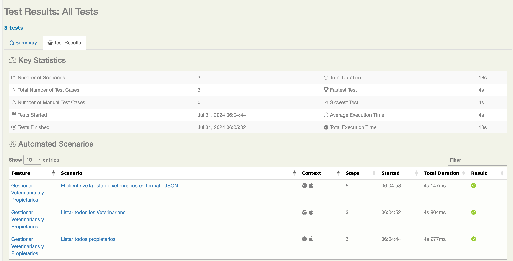

# Pruebas End-to-End para la Gestión de Veterinarios y Propietarios

Este repositorio contiene pruebas end-to-end (E2E) para la gestión de veterinarios y propietarios utilizando Cucumber, Serenity BDD y Java. La aplicación bajo prueba está disponible en [Spring Framework Pet Clinic](https://spring-framework-petclinic-qctjpkmzuq-od.a.run.app/).

## Tecnologías Utilizadas
- **Cucumber**: Para desarrollo basado en comportamiento (BDD).
- **Serenity BDD**: Para gestión e informes de resultados de pruebas.
- **Java 17**: Lenguaje de programación.
- **Maven 3.9.6**: Gestión de construcción y dependencias.

## Funcionalidad: Gestión de Veterinarios y Propietarios

El archivo de funcionalidades incluye escenarios para listar y verificar los datos de veterinarios y propietarios.

### Escenarios

#### 1. Listar Todos los Propietarios
- **Etiqueta:** `@listarPropietarios`
- **Escenario:** Listar todos los propietarios
- **Pasos:**
    - **Dado** que el cliente navega a la página de propietarios
    - **Cuando** el cliente realiza una acción para listar propietarios
    - **Entonces** la página debe mostrar una lista válida de propietarios

#### 2. Listar Todos los Veterinarios
- **Etiqueta:** `@ListarVeterinarians`
- **Escenario:** Listar todos los veterinarios
- **Pasos:**
    - **Dado** que el cliente navega a la página de veterinarios
    - **Cuando** el cliente realiza una acción para listar veterinarios
    - **Entonces** la página debe mostrar una lista válida de veterinarios

#### 3. Ver la Lista de Veterinarios en Formato JSON
- **Etiqueta:** `@VerJsonDeListaVeterinarians`
- **Escenario:** El cliente ve la lista de veterinarios en formato JSON
- **Pasos:**
    - **Dado** que el cliente navega a la página de veterinarios
    - **Cuando** el cliente realiza una acción para listar veterinarios
    - **Entonces** la página debe mostrar un enlace para abrir el JSON
    - **Cuando** el cliente hace clic en el enlace JSON
    - **Entonces** el cliente debe ver el JSON con la lista de veterinarios


### Ejecución de Pruebas

Para ejecutar las pruebas e2e, utiliza el siguiente comando:

```sh
mvn clean verify
```
